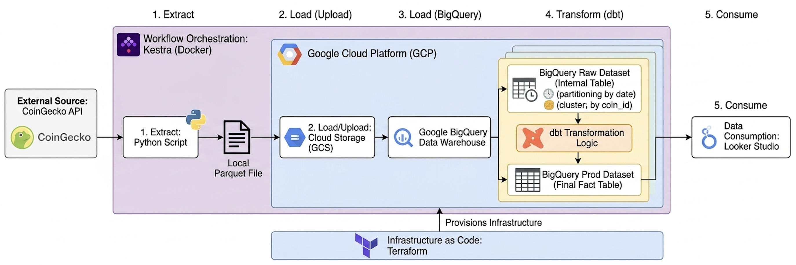

# BTC Return vs. USDT Volume Analysis

End-to-end analytics pipeline that joins **Bitcoin** and **Tether (USDT)** market snapshots from a single API source, lands them in a governed warehouse, and models **BTC price movement (volatility)** alongside **USDT trading volume** for reporting in **Looker Studio**.

[Dashboard Example](https://lookerstudio.google.com/reporting/d4c8e0f1-7f6b-43ee-9a4a-a19eb56c915a)

---

## Problem Statement

The cryptocurrency market is highly volatile, with Bitcoin (BTC) often experiencing sharp price declines, particularly since mid-last year. To mitigate risk during these downturns or periods of market panic, investors frequently convert their BTC holdings into USDT — a stablecoin pegged to the US dollar. This strategy allows them to preserve capital value without exiting the blockchain ecosystem, resulting in a "flight to safety," where BTC instability drives increased demand for USDT.

This project investigates the relationship between BTC price volatility and USDT trading volume. By building an automated data pipeline, it aims to quantify how market turbulence influences stablecoin activity, providing insights into investor behavior and risk-hedging patterns during bearish market conditions. 

---

## Data Pipeline Overview

The design follows **ELT**: extract and load first, transform in the warehouse.

1. **Extract** — Python tasks call the **CoinGecko API** for `bitcoin` and `tether` to fetch their market data.
2. **Load** — Fetched raw data are written to **Parquet** and uploaded to **Google Cloud Storage** (GCS). Then, **BigQuery** loads Parquet into a staging table, then **MERGE**s into the internal table  `raw_dataset.crypto_market`.
3. **Transform** — **dbt** reads `raw_dataset.crypto_market`, builds `stg_crypto_market` → `int_btc_usdt_joined` → `fct_btc_usdt_correlation` in `prod_dataset`.
4. **Consume** — **Looker Studio** connects to BigQuery (typically the  `prod_dataset`) for charts and exploration.

Orchestration is **Kestra**: a daily flow ingests T−1 data on a schedule; a history flow backfills a date range; a dbt flow runs after either ingest succeeds.

- The history flow is significantly faster than the built-in backfill feature in the daily trigger. It is recommended to run this history flow once during the initial setup; thereafter, the daily flow will be handled automatically by the scheduled trigger.

### Architecture
 

### Repository Layout


| Path                 | Role                                                                        |
| -------------------- | --------------------------------------------------------------------------- |
| `terraform/`         | Set up GCP resources                                                        |
| `kestra/`            | Contains Kestra flow files for the workflow orchestration                   |
| `scripts/`           | `extract_data_daily.py`, `extract_data_history.py` (mirrors pipeline logic) |
| `dbt/btc_analysis/`  | dbt project: staging → intermediate → mart                                  |
| `docker-compose.yml` | Set up Kestra to run in a container                                         |


---

## Technologies Used


| Layer                 | Technology                                                  |
| --------------------- | ----------------------------------------------------------- |
| Source API            | [CoinGecko API](https://www.coingecko.com/en/api)           |
| Orchestration         | [Kestra](https://kestra.io/) (Docker, `docker-compose.yml`) |
| Extract / file format | Python 3.11, `requests`, `pandas`, `pyarrow` → **Parquet**  |
| Object storage        | **Google Cloud Storage**                                    |
| Warehouse             | **Google BigQuery**                                         |
| IaC                   | **Terraform** (Google provider)                             |
| Transformations       | **dbt** (`dbt-bigquery`)                                    |
| BI (downstream)       | **Looker Studio**                                           |
| Local Python env      | `uv`                                                        |


---

## Data Warehouse Optimization

The **internal** table `raw_dataset.crypto_market` is created by Kestra using gcp.bigquery.Query with:

- **Partitioning:** `PARTITION BY DATE(date)` — pruning by calendar day for time-window queries and incremental patterns.
- **Clustering:** `CLUSTER BY coin_id` — colocates `bitcoin` and `tether` rows for faster filters and joins on `coin_id`.

Terraform provisions `**raw_dataset`** and `**prod_dataset`**; table DDL and merge logic live in the Kestra flows so the physical design stays aligned with the load jobs.

---

## Data Sources

- **CoinGecko API**
  - **Daily / snapshot:** `GET /api/v3/coins/{coin_id}/history` with `date` in `DD-MM-YYYY`.
  - **Historical backfill:** `GET /api/v3/coins/{coin_id}/market_chart/range` with `vs_currency=usd`, Unix `from` / `to`, `interval=daily`.

---

## Prerequisites

- **Google Cloud Platform**
  - A GCP project.
  - **BigQuery** and **Cloud Storage** enabled.
  - A **service account** JSON key with permissions of BigQuery Admin, Storage Admin.
- **Terraform**
- **Python**
- **Docker** and **Docker Compose**
- **Git**

---

## Setup Instructions

Follow these in order. Replace every placeholder with **your** project, bucket, and secrets.

### 1. Clone the Project Repository

```bash
git clone https://github.com/Jessie2019W/BTC-Return-Stablecoin-Volume-Analysis.git
cd BTC-Return-Stablecoin-Volume-Analysis
```

### 2. GCP Credentials Setup

- To reproduce this project, you must configure a dedicated Service Account to allow Terraform to manage resources.
  - **Create Service Account:**
    - Log in to the [GCP Console](https://console.cloud.google.com/).
    - Navigate to **IAM & Admin** > **Service Accounts**.
    - Click **+ CREATE SERVICE ACCOUNT** at the top of the page.
  - **Assign Permissions:** Select the following two roles to grant the necessary access:
    - **Storage Admin**: For managing Google Cloud Storage (GCS) buckets.
    - **BigQuery Admin**: For managing datasets and tables.
  - **Generate Key:**
    - After creating the account, go to the **Keys** tab.
    - Select **Add Key** > **Create new key** in **JSON** format.
    - Download the file and rename it to gcp_key.json.
  - **Security & Storage:**
    - Create a folder named .credentials in your project root directory.
    - Save gcp_key.json into this folder.

### 3. Configure Terraform for GCP

Edit `terraform/variable.tf`:


| Variable          | What to change                                                                |
| ----------------- | ----------------------------------------------------------------------------- |
| `project`         | **Your GCP project ID**.                                                      |
| `credentials`     | Path to your service account JSON (defaults: `../.credentials/gcp_key.json`). |
| `gcs_bucket_name` | **Globally unique** GCS bucket name.                                          |


Apply:

```bash
cd terraform
terraform init
terraform plan
terraform apply
```

### 4. Start Kestra using Docker Compose

From the repo root (`cd ..`):

```bash
docker compose up -d
```

UI defaults are set in `docker-compose.yml` (e.g. `http://localhost:8080`).

### 5. Kestra Configuration

#### Create Flows

Create three new workflows with:  

- kestra/crypto_market_data_pipeline.yaml
- kestra/upload_history.yaml
- kestra/dbt_flow.yaml

All three flows default to the `dev` namespace.

#### KV store

In Kestra UI, create following KV entries under the namespace `dev`:


| Key               | Purpose                                   |
| ----------------- | ----------------------------------------- |
| `GCP_PROJECT_ID`  | Same as `project` in Terraform.           |
| `GCP_BUCKET_NAME` | Same as `gcs_bucket_name` in Terraform.   |
| `GCP_CREDS`       | **Contents** of the service account JSON. |


If any key is missing, GCS upload, BigQuery steps, or dbt will fail with auth errors.

### 6. Run pipelines in Kestra

Execute `history_data_pipeline` — Select `start_date` and `end_date` inputs (defaults in YAML include an example start date).

- Please note that the free public CoinGecko API is limited to the last 365 days of data; ensure you select your date range based on the current execution date.

Once the above workflow completes successfully, it will automatically trigger the `dbt_model` flow.

The `crypto_market_data_pipeline` flow is designed for daily production use. It triggers automatically every morning at **8:00 AM** to extract the previous day's market data. Upon completion, it automatically triggers the `dbt_model` flow to update the data in the warehouse.

### 7. Looker Studio Dashboard

Data source is linked to BigQuery: project `GCP_PROJECT_ID`, dataset `prod_dataset`, table  `fct_btc_usdt_correlation` 
[Dashboard Example](https://lookerstudio.google.com/reporting/d4c8e0f1-7f6b-43ee-9a4a-a19eb56c915a)
